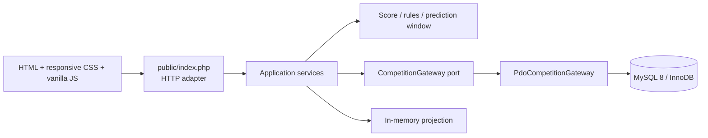

# Competition Engine Demo

> A runnable, framework-free PHP/MySQL reference application for predictions, transactional result finalization, deterministic scoring, rankings, and non-persistent scenario simulation.

**PHP 8.2+ · MySQL 8+ · PDO · Vanilla JavaScript · Responsive CSS · executable tests**

This portfolio project turns a compact sports-prediction domain into real executable engineering work: authoritative deadlines, explicit scoring precedence, safe writes, window-function rankings, an isolated simulator, and a responsive interface—all using synthetic data.

> **Independence statement:** This repository is an independent public reference implementation created for portfolio purposes. It does not contain or reproduce PickPlay production source code.

## Engineering highlights

- **Deterministic domain model:** pure value objects and scoring service, independent of HTTP and storage.
- **Integrity under concurrency:** a competition-membership lock serializes each participant's writes; wildcard usage and the authoritative match deadline are rechecked inside the transaction.
- **Atomic, one-way finalization:** result update and every prediction award commit or roll back together, and finalized results cannot be silently replaced.
- **Stable rankings:** MySQL 8 `ROW_NUMBER()` orders by points, exact results, participant name, then immutable ID.
- **Safe simulation:** a read-only snapshot is projected in memory; no write method is called.
- **Defense in depth:** native prepared statements, CSRF tokens, escaped output, strict validation, secure cookie flags, and a separate admin token boundary.

## Screenshots

The application includes a polished responsive dashboard. Future release screenshots can be stored under `docs/screenshots/`:

| Desktop dashboard | Mobile match cards |
| --- | --- |
| _Screenshot placeholder_ | _Screenshot placeholder_ |

## Architecture



The layers deliberately stay small. `Domain` owns pure rules, `Application` coordinates use cases through a port, `Infrastructure` implements persistence, and `public` translates HTTP requests and renders escaped views. See [Architecture](docs/architecture.md) and [Data model](docs/data-model.md).

## Scoring model

Rules are evaluated in strict descending precedence:

| First matching rule | Points |
| --- | ---: |
| Exact score | 5 |
| Correct draw | 2 |
| Correct goal difference | 3 |
| Correct winner | 2 |
| Otherwise | 0 |

An optional, once-per-competition wildcard multiplies the winning award by **1.5**. Draw is checked before goal difference so its explicit two-point rule remains reachable. This potentially subtle precedence is intentional and tested. More detail is in [Scoring decisions](docs/scoring.md).

## Quick start with Docker

Prerequisites: Docker with Compose.

```bash
git clone https://github.com/Vladilusion/competition-engine-demo.git
cd competition-engine-demo
docker compose up
```

Open <http://localhost:8080>. The demo admin token is `local-demo-admin`. To reset all seed data, run `docker compose down -v` before starting again.

## Local setup without Docker

Prerequisites: PHP 8.2+ with `pdo_mysql`, and MySQL 8+.

```bash
cp .env.example .env
# Edit database values and ADMIN_TOKEN in .env
mysql -u root -p < database/schema.sql
mysql -u root -p < database/seed.sql
php -S 127.0.0.1:8080 -t public
```

Open <http://127.0.0.1:8080>. All datetimes are interpreted by MySQL/PHP in the host's configured timezone; production deployment should explicitly standardize both to UTC.

## Tests and quality checks

No Composer install is required:

```bash
php tests/run.php
find config public src tests -name '*.php' -print0 | xargs -0 -n1 php -l
git diff --check
```

The lightweight test runner covers exact score, goal difference, winner, draw, incorrect prediction, wildcard multiplication, precedence, prediction timing boundaries, and simulator isolation. CI waits for a successful authenticated query, imports the schema and seed into MySQL 8.4, then runs database-backed smoke checks for ranking, explicit prediction insert/update, second-wildcard isolation, and one-way finalization.

## Security and integrity

- Scores are integer-only and range checked in both HTTP input and the domain object.
- Prediction context verifies participant membership and match ownership.
- The initial deadline check provides a useful response; membership serialization plus the match row-lock/deadline and wildcard rechecks inside the transaction are the final authority.
- Prediction updates target an explicitly selected row; no ambiguous multi-constraint upsert can mutate a different wildcard prediction.
- Every write uses a prepared statement and transactional error rollback.
- POST actions require session-bound CSRF tokens; cookies are `HttpOnly`, `SameSite=Lax`, and `Secure` under HTTPS.
- Result finalization requires an environment-supplied admin token. This intentionally simple demo boundary should be replaced by identity/RBAC in production.
- HTML values are escaped at output. No real credentials or personal data are included.

See [Security and integrity](docs/security.md) and [Simulation isolation](docs/simulation.md).

## Repository structure

```text
config/          bootstrap, environment and secure session setup
database/        normalized MySQL schema and synthetic seed data
docs/            concise technical decision records
public/          front controller and browser assets
src/Domain/      pure scoring and deadline rules
src/Application/ use cases and persistence port
src/Infrastructure/ PDO/MySQL gateway
tests/           dependency-free executable test suite
```

## Key decisions and limitations

- A dependency-free test harness keeps first-run setup minimal; a larger codebase could adopt PHPUnit.
- Participant selection is an explicit demo persona switch, not authentication. Admin writes still have a distinct authorization check.
- Ranking ties are deliberately broken rather than displayed as shared positions: points ↓, exact scores ↓, name ↑, ID ↑.
- Seed match dates are fixed for reproducibility. Adjust them when exploring deadline behavior after June 2027.
- The project is compact by design: no account lifecycle, notifications, league scheduling, pagination, or production deployment stack.
- `DECIMAL(6,2)` avoids floating-point persistence surprises; the pure scoring API uses floats because the configured multiplier is finite and exactly representable here.

## Relationship to the PickPlay case study

The concepts are inspired only by the publicly described engineering themes in the [PickPlay engineering case study](https://github.com/Vladilusion/pickplay-case-study). Names, schema, data, UI, architecture, and all source in this repository were independently created for this public demo. It neither claims compatibility with nor reconstructs any proprietary system.

## License

See [LICENSE](LICENSE).
